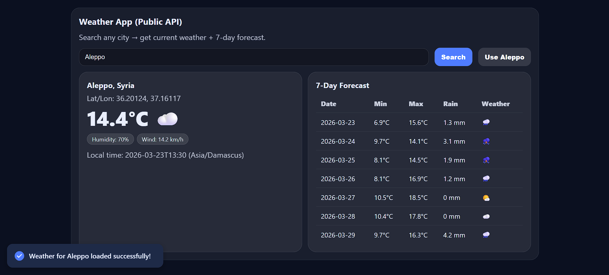

# 🌦 Weather App (React Version)



## Project

Weather App built with React to search any city and view current weather plus a 7-day forecast.

## Features

- Search weather by city name
- Display current temperature, humidity, and wind speed
- Show 7-day weather forecast
- Loading indicator while fetching data
- Error handling for invalid cities or network issues
- Responsive UI for desktop and mobile

## Tech Stack

- React (Functional Components & Hooks)
- HTML5 & CSS3
- JavaScript (ES6+)
- Open-Meteo API
- Geocoding API

## How It Works

1. User enters a city name.
2. App uses Geocoding API to get the city's coordinates.
3. App fetches weather data from Open-Meteo API.
4. Weather data is dynamically rendered using React components.

## Run the Project

1. Clone the repository:
   ```bash
   git clone https://github.com/codewithkamikaze/weather-app-react.git
   ```
